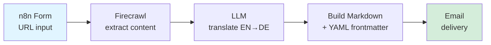
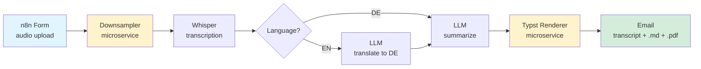

# Content Pipelines

Two n8n workflows that turn messy inputs — URLs, audio files — into clean, structured, multilingual deliverables. Built for personal use, packaged for reuse.


---

## What's in here

| Workflow | Input | Output | What it's good for |
|---|---|---|---|
| [**Article Translator**](#1-article-translator) | URL to an EN article | DE markdown with YAML frontmatter, delivered by email | Turning foreign-language source material into filed, searchable notes |
| [**Sermon Pipeline**](#2-sermon-pipeline) | Audio file (EN or DE) | Transcript + structured DE summary as `.md` and `.pdf`, delivered by email | Making long-form spoken content into skimmable, archivable documents |

Both workflows run end-to-end unattended. Submit a form, get the output in your inbox.

---

## 1. Article Translator

### Flow



### What it does

1. User pastes an article URL into an n8n form
2. Firecrawl pulls clean article content (strips nav, ads, boilerplate)
3. LLM translates title and body EN → DE, preserving structure
4. Output is assembled as a markdown file with YAML frontmatter (source URL, date, tags, original title)
5. File is emailed to a configurable address

### Sample output

See [`samples/article-output.md`](samples/article-output.md) for a real file this workflow produced.

---

## 2. Sermon Pipeline

The more involved one. Two custom microservices, a transcription step, conditional translation, and structured PDF output.

### Flow



Yellow = self-built microservices (see [Microservices](#microservices) below).

### What it does

1. User uploads an audio file (EN or DE) via n8n form
2. **Downsampler** microservice reduces file size for faster/cheaper transcription
3. Whisper transcribes to text
4. If source is EN, an LLM translates to DE; otherwise skip
5. LLM summarizes the transcript following a fixed schema (key points, themes, quotes, scripture references)
6. **Typst renderer** microservice converts the summary markdown to a typeset PDF
7. Transcript (`.md`), summary (`.md`), and summary (`.pdf`) are emailed

### Sample output

- [`samples/sermon-transcript.md`](samples/sermon-transcript.md)
- [`samples/sermon-summary.md`](samples/sermon-summary.md)
- [`samples/sermon-summary.pdf`](samples/sermon-summary.pdf)

---

## Demo

> 📹 **60-second walkthrough:** [Loom link](#) *(replace with your Loom URL)*

For the faster path, the samples above show exactly what comes out the other end.

---

## Microservices

Two small services written for this project, published as container images with CI:

| Service | Purpose | Repo | Image |
|---|---|---|---|
| `audio-downsampler` | Reduce audio bitrate/sample rate before transcription to cut cost and time | [→ repo](#) | `ghcr.io/yourname/audio-downsampler:latest` |
| `typst-renderer` | Convert markdown to typeset PDF via [Typst](https://typst.app) | [→ repo](#) | `ghcr.io/yourname/typst-renderer:latest` |

Each has its own README, `curl` example, and GitHub Actions workflow publishing to GHCR on every tag.

---

## Running it yourself

### Prerequisites

- Docker + Docker Compose
- API keys for the LLM provider(s) you want to use (see below)
- A Firecrawl API key (free tier works for low volume)
- An SMTP account for email delivery

### Setup

```bash
git clone https://github.com/yourname/content-pipelines.git
cd content-pipelines
cp .env.example .env
# fill in API keys and SMTP credentials
docker compose up -d
```

Open `http://localhost:5678`, import `workflows/article-translator.json` and `workflows/sermon-pipeline.json`, and activate them. The forms will be available at the URLs n8n prints in the workflow.

### LLM provider

Both workflows are **provider-agnostic**. The LLM calls are configured via n8n credentials, so you can run them against:

- OpenAI (`gpt-4o`, `gpt-4o-mini`)
- Anthropic (`claude-sonnet-4`, `claude-haiku-4-5`)
- Self-hosted via Ollama / vLLM / any OpenAI-compatible endpoint
- Azure OpenAI

Swap the credential in n8n — no workflow changes needed.

---

## Repo structure

```
content-pipelines/
├── README.md
├── docker-compose.yml          # n8n + both microservices, prebuilt images
├── .env.example                # all required secrets, commented
├── workflows/
│   ├── article-translator.json # exported n8n workflow, secrets scrubbed
│   └── sermon-pipeline.json
├── samples/
│   ├── article-output.md
│   ├── sermon-transcript.md
│   ├── sermon-summary.md
│   └── sermon-summary.pdf
└── diagrams/
    ├── article-flow.svg
    └── sermon-flow.svg
```

---

## Notes on security and deployment

- **Secrets:** All API keys live in `.env`, never committed. Workflow JSON exports use n8n credential references (`{{ $credentials... }}`), not literal keys.
- **Self-hosted n8n:** Workflows run on a private instance, not n8n Cloud. Inputs and outputs never leave infrastructure I control except for the explicit LLM / Firecrawl / SMTP calls.
- **LLM provider choice:** Because the workflows are provider-agnostic, they can run fully on-premise (Ollama, vLLM behind a VPC) when data sensitivity requires it.

---

## Why these workflows

The surface-level use cases are personal — translating articles I want to read, archiving sermons. But the patterns behind them generalize well:

- **Workflow 1** is »ingest content in language A, produce structured output in language B« — a shape that shows up anywhere documentation, service bulletins, or customer-facing content needs to cross language boundaries.
- **Workflow 2** is »audio → transcript → translation → structured summary → formatted deliverable« — the same pipeline you'd want for field voice notes, customer calls, or any long-form spoken input that needs to become searchable, skimmable text.

Both lean on the same primitives: conditional routing, microservice composition, multilingual LLM work, and formatted output. Nothing exotic — just shipped.

---

## License

MIT. See [LICENSE](LICENSE).
