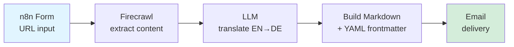
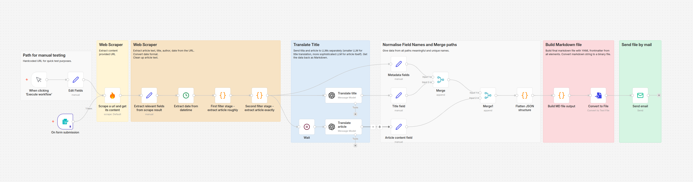
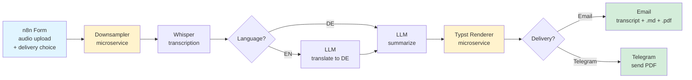
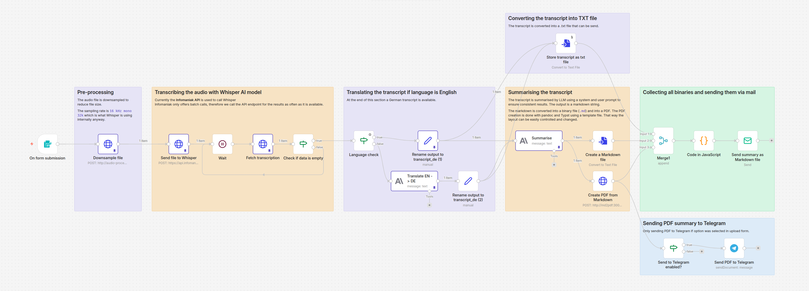

# Content Pipelines

Two n8n workflows that turn messy inputs — URLs, audio files — into clean, structured, multilingual deliverables. Built for personal use, packaged for reuse.


---

## What's in here

| Workflow | Input | Output | What it's good for |
|---|---|---|---|
| [**Article Translator**](#1-article-translator) | URL to an EN article | DE markdown with YAML frontmatter, delivered by email | Turning foreign-language source material into filed, searchable notes |
| [**Sermon Pipeline**](#2-sermon-pipeline) | Audio file (EN or DE) | Transcript + structured DE summary as `.md` and `.pdf`, delivered by email or Telegram | Making long-form spoken content into skimmable, archivable documents |

Both workflows run end-to-end unattended. Submit a form, get the output in your inbox.

---

## 1. Article Translator

### Flow



### What it does

1. User pastes an article URL into an n8n form
2. Firecrawl pulls clean article content (strips nav, ads, boilerplate)
3. LLM translates title and body EN → DE, preserving structure
4. Output is assembled as a markdown file with YAML frontmatter (source URL, date, tags, original title)
5. File is emailed to a configurable address

### Screenshot of the n8n canvas



### Sample output

See [`samples/article-output.md`](samples/article-output.md) for a real file this workflow produced.

---

## 2. Sermon Pipeline

The more involved one. Two custom microservices, a transcription step, conditional translation, and structured PDF output.

### Flow



Yellow = self-built microservices (see [Microservices](#microservices) below).

### What it does

1. User uploads an audio file (EN or DE) via n8n form and selects a delivery channel (email or Telegram)
2. **Downsampler** microservice reduces file size for faster/cheaper transcription
3. Whisper transcribes to text
4. If source is EN, an LLM translates to DE; otherwise skip
5. LLM summarizes the transcript following a fixed schema (key points, themes, quotes, scripture references)
6. **Typst renderer** microservice converts the summary markdown to a typeset PDF
7. Delivery branches on the form choice:
   - **Email** — transcript (`.md`), summary (`.md`), and summary (`.pdf`) as attachments
   - **Telegram** — summary PDF pushed to a configured chat via bot


### Screenshot of the n8n canvas



### Sample output

- [`samples/sermon-transcript.md`](samples/sermon-transcript.md)
- [`samples/sermon-summary.md`](samples/sermon-summary.md)
- [`samples/sermon-summary.pdf`](samples/sermon-summary.pdf)

---

## Demo

> 📹 **60-second walkthrough:** [Loom link](#) *(replace with your Loom URL)*

For the faster path, the samples above show exactly what comes out the other end.

---

## Microservices

Two small services written for this project, published as container images with CI:

| Service | Purpose | Repo | Image |
|---|---|---|---|
| `audio-downsampler` | Reduce audio bitrate/sample rate before transcription to cut cost and time | [→ repo](https://github.com/toestre/audio-tools) | `ghcr.io/toestre/audio-tools:lates` |
| `typst-renderer` | Convert markdown to typeset PDF via [Typst](https://typst.app) | [→ repo](https://github.com/toestre/md2pdf) | `ghcr.io/toestre/md2pdf:latest` |

Each has its own README, `curl` example, and GitHub Actions workflow publishing to GHCR on every tag.

## Repo structure

```
content-pipelines/
├── README.md
├── workflows/
│   ├── article-translator.json # exported n8n workflow, secrets scrubbed
│   └── sermon-pipeline.json
├── samples/
│   ├── article-output.md
│   ├── sermon-transcript.md
│   ├── sermon-summary.md
│   └── sermon-summary.pdf
└── diagrams/
    ├── article-flow.svg
    └── sermon-flow.svg
```

---

## Why these workflows

The surface-level use cases are personal — translating articles I want to read, archiving sermons. But the patterns behind them generalize well:

- **Workflow 1** is »ingest content in language A, produce structured output in language B« — a shape that shows up anywhere documentation, service bulletins, or customer-facing content needs to cross language boundaries.
- **Workflow 2** is »audio → transcript → translation → structured summary → formatted deliverable« — the same pipeline you'd want for field voice notes, customer calls, or any long-form spoken input that needs to become searchable, skimmable text.

Both lean on the same primitives: conditional routing, microservice composition, multilingual LLM work, and formatted output. Nothing exotic — just shipped.

---

## License

MIT. See [LICENSE](LICENSE).
